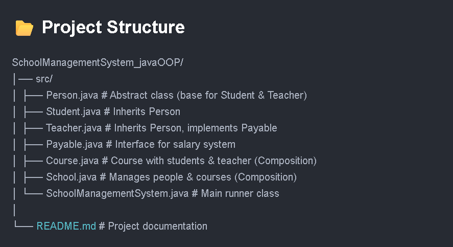

# 🏫 School Management System (Java OOP Project)

A **Java-based School Management System** built to demonstrate **core Object-Oriented Programming (OOP) concepts** including **Encapsulation, Inheritance, Polymorphism, Abstraction, Interfaces, and Composition**.   

---

## 🚀 Features
- **Encapsulation** → Private fields with getters/setters for safe data handling  
- **Inheritance** → `Student` and `Teacher` extend `Person`  
- **Polymorphism** → `printRole()` behaves differently for Student and Teacher  
- **Abstraction** → Abstract class `Person` & `Payable` interface  
- **Composition** → `School` has `Courses`, `Course` has Students and Teacher  
- **Interface Implementation** → Salary system using `Payable`  

---

## 📂 Project Structure

---

## 🛠️ Technologies Used
- **Java 23.0.1** 
- **OOP Concepts** (Encapsulation, Inheritance, Polymorphism, Abstraction, Composition, Interfaces)  
- **Collections Framework** (ArrayList for managing objects)  

---

